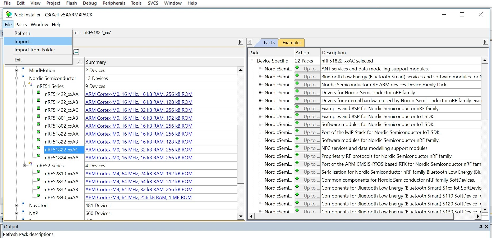
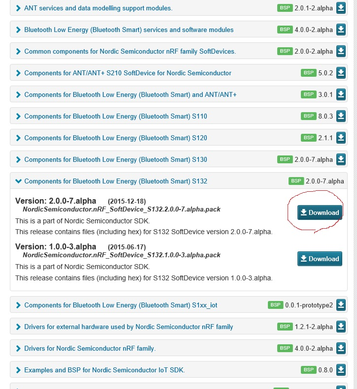
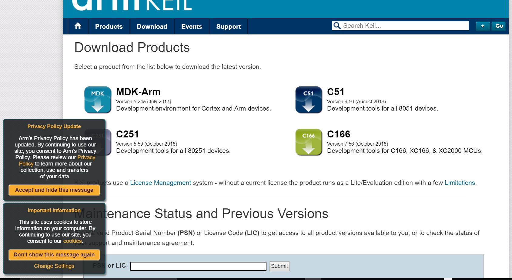
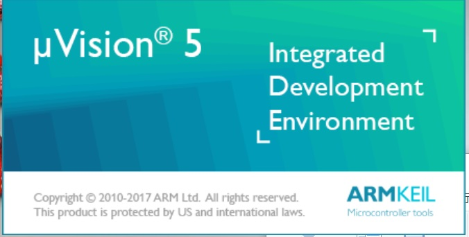
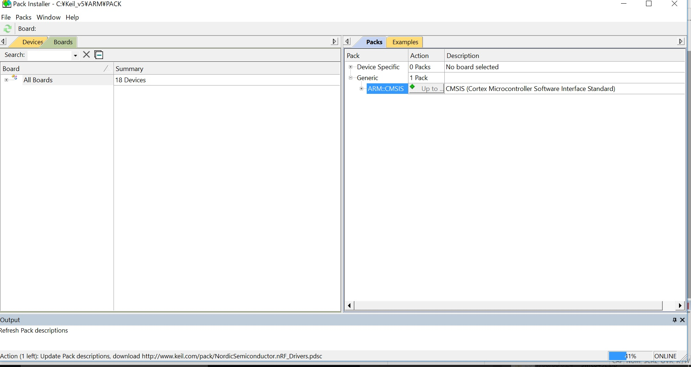
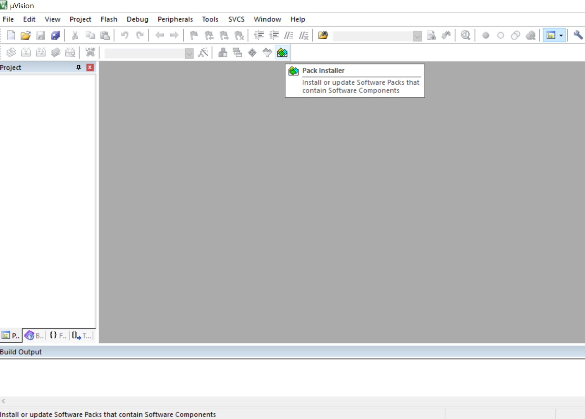
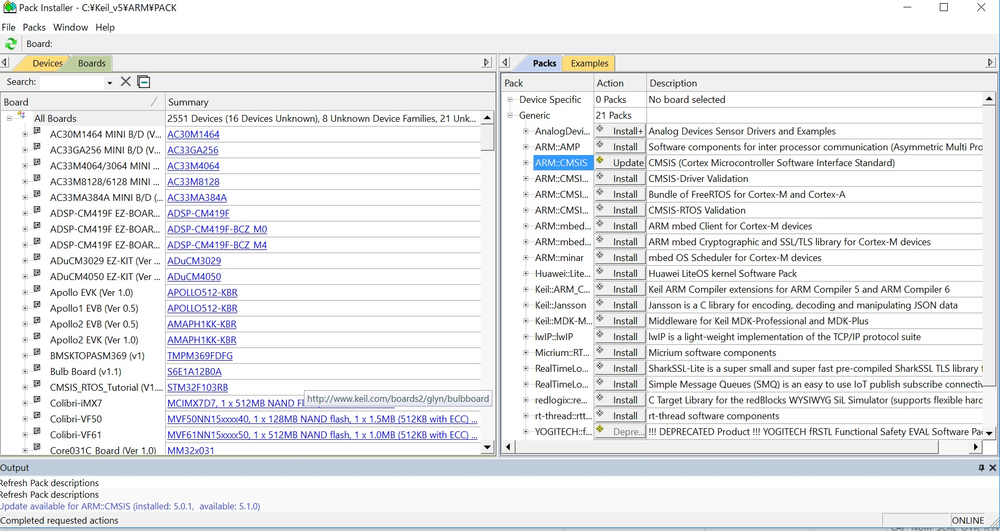
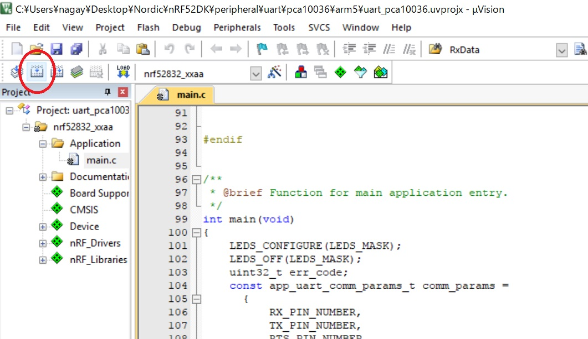
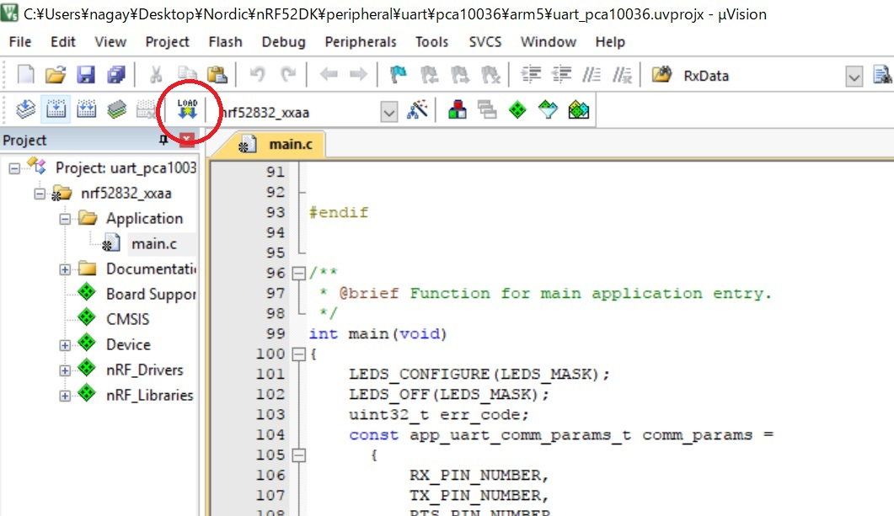

# OpenBeacon

## Firmwareの焼き方

[Firmwareの焼き方](./docs/README.md)

## 概要（nrfgoの場合）
NordicｎRF51またはｎRF52で、すでにビルドされているhexファイルを書き込む方法を説明します。ここではNodic NRF51を使用している技適認証済みBLEモジュールRaytacMDBT40を例としています。ファームウェアは、ソフトデバイスとアプリケーションの２つで構成されております。

## 環境構築
### nrfgoStudioをインストール
Windows(Vista以降)を用意。Windowsの場合は、GUIによりファームウェア書き込みできるWindowsアプリケーションnRFgo Studioがあり、Windows64ビット版nRFgo Studio-Win64ダウンロードし、typicalに設定しインストールします。さらに、自動的にウィザードが立ち上がり、Commnad-Toolチェーンも一緒にインストールします。
ダウンロード先：
https://www.nordicsemi.com/jpn/node_176/2.4GHz-RF/nRFgo-Starter-Kit

MDK5 Software Packsダウンロード先
最新のデバイスパックをダウンロードする場合は、直接KeilのWebサイトからNordicSemiconductorの欄からダウンロードして更新する。最新デバイスファミリーパックをダウンロードします。
http://www.keil.com/dd2/pack/

ダウンロードしたら、KeilのPackInstalerボタンを押して、ImportしてKeilに取り込みます。

nRFgoダウンロード

### ソフトデバイスをインストール

nrfgoStudioをインストールしたら、無線やデータを管理する基本ソフトウェアのソフトデバイスを準備する。ソフトデバイスには３種類あり、目的にあったソフトウェアデバイスを使用しなくてはいけない。ビーコンは、ペリフェラル機器なのでs110。セントラルはS120,ペリフェラルとセントラルになるものは、今回の例では、s130をダウンロードして、指定してください。なお、バージョンにもご注意ください。高機能になるほど容量が大きいのでRAMやROMの空き容量など注意が必要になります。

ソフトデバイスをダウンロード
http://www.nordicsemi.com/eng/Products/Bluetooth-Smart-Bluetooth-low-energy/nRF51822

・ダウンロードできるソフトデバイス一覧

nRF51であれば、以下のものをダウンロードすれば十分でしょう。

s110の場合は、S110-SD-v8をダウンロード

s130の場合は、S130-SDをダウンロード　

Keil内に取り込まれたのサンプルコード(Example)場合でペリフェラルでのS132はこちらの２．０．０－７アルファ版をダウンロードしてご使用ください。その他サンプルコードによって対象になるソフトデバイスを選択してください。

MDK5 Software Packsおよびサンプルコード等ダウンロード先
http://www.keil.com/dd2/pack/

## ファームウェア（FW)を書き込む

### 接続方法
Nordic nRF51882のコアはARMマイコンが内蔵してあり、ARMマイコンのデバッグにはJ-linkが必要になる。J-linkにはARMマイコンによってターゲット対象が異なり、Nordic nRF51882(ARM M0)は安価なJ-link liteのグレード以上(OEMによる購入)が必要となります。（使い勝手は多少悪くなりますがnRF51DKでも書き込みは可能です。）書き込みのインターフェースにはJ-TAGの機能縮小版のSWDで通信を行います。また、書き込むには、（BLEなど）ターゲットにも３Vの電源が必要になります。Fabo製BLEの場合は、Fabo 2004 JLinkを用意し、J-LinkLiteをパソコンへつなぎ、下記の写真のようにします。

接続の様子

### フラッシュメモリを初期化
RaytacBeacon MDBT40の場合は、はじめからデフォルトのテストファームウェアが入っており、ファームウェアを更新する場合でも、フラッシュメモリ領域に残っているので、 すべて初期化や消去しなくてはいけない。nrfgoStudioで簡単に消去できます。

・ターゲットとアクセス
nRFgo studioを起動してターゲットをJ-linkと接続してnRF5x Programmingを選択すると、J-linkLiteのLEDが点滅しアクセスが始まる。（Windwos10ではnrfgoStudioが落ちやすいです。）

・ファームウェア消去
nrfgoStudioの Erase allボタンを押します。

ファームウェア消去後、空きフラッシュROMが256KBになる。（nRF51の中には、128KBサイズになるものがあるので注意、nRF52は512KB）

### ソフトデバイスの書き込み
ソフトデバイスをスタック領域に書き込みます。 Softdevieタブを選択して、任意のファイル解凍したファイルの中にs130_nrf51_2.0.1_softdevice.hex（今回の場合）があります。これを選択し書き込みます。

任意のソフトデバイスを選択。programボタンを押すことで書き込みが開始されます。

ソフトデバイスが書き込みが成功すると、successfullyが表示され、Region0(Softdevice)ができます。

### ファームウェアを書き込む

バイナリ化されたファームウェアを書き込む。Program Applicationタブを選択して、任意の.hexファイルを選択しWriteボタンを押して書き込む。successfullyの表示がでたら、終了。パケットスニファー等で電波が出ているかを確認する。なお、ファームウェアの偽造防止のため、吸出し防止する場合は、Lock entire chip from readback チェックをすることで、禁止することができます。ほかにもVerify,Readボタンで書き込みのチェック、ファームウェアの吸出しもできます。

任意のアプリケーションを選択。programボタンで書き込みが開始されます。

アプリケーションが書き込みが成功すると、Region１にアプリケーションが書き込まれます。

書き込み後は、電波が出ているかどうか、BLE対応パケットスニファやアプリケーション（iBeaconで使えるiPhoneアプリAkabeaconManagerなど)により確認してください。

## ファームウェア書き込み　Keilの場合
ソースファイルからビルドして書き込む場合を説明いたします。
ARMマイコンのビルドには今回ARM社から出ているKeilを使用します。
ARM純正のコンパイラが使用できます。

### Keilのダウンロード

統合開発環境のKeil　ARMマイコン他にも８０５１シリーズ等が開発できます。
今回は、MDK－Armをダウンロードします。

ダウンロード先　Keilはコードサイズ３２KBまでなら無償で使用できます。

https://www.keil.com/download/product/

インストールしたらKeilを起動します。

### PackInstaller

ネットにつながっていれば、自動的にターゲット候補がダウンロードします。

ARMマイコン、ARM採用のボードには多種多様があり、それぞれ合わせた開発に必要なソフトウェア群をKeilにインストールします。下記のPackinstallerボタンを押します。

ターゲットとなる左のリストBoardタブからボードを探し、右からそれぞれ必要なソフトウェアをInstallボタンをおして、インストールします。※こちらからサンプルコードもダウンロードできます。

### ビルド

ソースコードを入手し、Keilを立ち上げ、前項のNRFgoなどを使いターゲットのフラッシュを消去します。ビルドのボタンを押してビルドを開始します。

ビルドに成功したら、書き込みができます。

### 書き込み

上記のNRFgoと同じようにターゲットと接続いたします。
Loadボタンを押してターゲットに書き込みを行います。

正しくつながっていれば書き込みは完了します。
